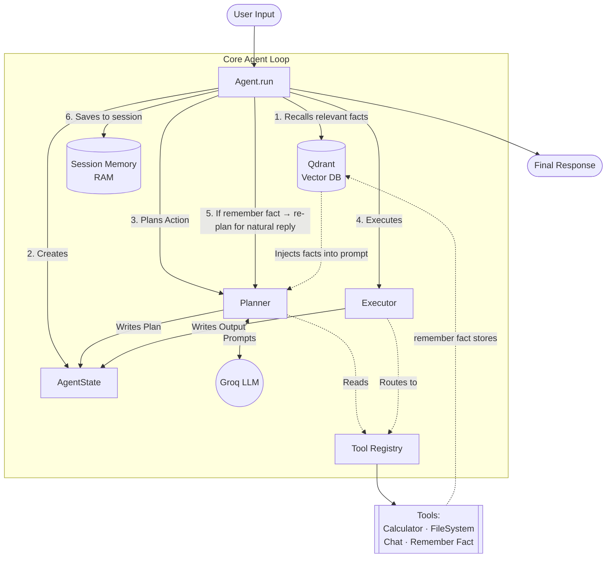

# Custom AI Agent Framework 🤖

A modular, from-scratch AI Agent framework built in Python. This project demonstrates the core mechanics of how modern LLM agents operate under the hood, completely bypassing heavy abstractions like LangChain or LlamaIndex.

By building the orchestration layer manually, this framework showcases a deep understanding of **State Management**, **Tool Execution**, **Session Memory**, **Long-Term Memory**, and **DSPy-based prompt optimization**.

## 🌟 Key Features

* **Zero-Abstraction Architecture**: Built entirely from scratch to understand and control the exact flow of data between the LLM and the tools.
* **Modular Tool Registry**: A scalable registry pattern that allows developers to dynamically register new tools without modifying the core agent logic.
* **Session Memory**: Implements short-term conversational memory, allowing the agent to retain context across multiple conversational turns.
* **Long-Term Memory (Qdrant)**: Persists important facts (name, preferences, etc.) in a Qdrant vector database using semantic embeddings. Facts survive across restarts and are retrieved via similarity search.
* **Remember Fact Tool**: The LLM autonomously decides when to store user information into long-term memory using the `remember fact` tool, without any manual intervention.
* **State-Driven Routing**: Passes a unified `AgentState` object through the Planner and Executor nodes for clean, predictable execution (similar to LangGraph).
* **Groq Integration**: Powered by Groq API for lightning-fast inference.
* **DSPy RL Optimization**: Uses DSPy's `BootstrapFewShot` optimizer to automatically improve the planner prompt from labeled training examples — no manual prompt engineering needed.

## 🏗️ Architecture



The framework is broken down into distinct, decoupled components:

1. **`Planner`**: Takes the user's natural language query, conversation history, and long-term facts, then outputs a structured JSON plan of action.
2. **`Executor`**: Parses the Planner's JSON output, safely executes the requested Python tools, and catches any runtime errors.
3. **`State` (`AgentState`)**: A Dataclass that holds the current query, planned actions, and final response for the current execution loop.
4. **`Memory`**: Manages both session memory (RAM) and long-term memory (Qdrant vector DB).
5. **`LongTermMemory`**: Embeds and stores key-value facts in Qdrant using `sentence-transformers`. Performs semantic search at query time to inject relevant context.
6. **`Tool Registry`**: A centralized dictionary mapping tool names to actual Python classes, automatically generating tool descriptions for the LLM.

## 🧠 Long-Term Memory Flow

```
User: "My name is Siddhesh"
    ↓
Planner picks "remember fact" tool
    ↓
RememberFactTool stores "user_name | Siddhesh" → Qdrant (persists forever)
    ↓
Agent re-plans → gives a natural reply: "Nice to meet you, Siddhesh!"

Next session (after restart):
User: "What's my name?"
    ↓
Qdrant semantic search finds "user_name: Siddhesh"
    ↓
Agent: "Your name is Siddhesh!"
```

## 🔬 DSPy RL Optimization

The `RL/` folder contains a prompt optimization pipeline using [DSPy](https://github.com/stanfordnlp/dspy)'s `BootstrapFewShot` optimizer.

```
Training Examples (RL/training_data.py)
    ↓
BootstrapFewShot Optimizer (RL/optimize.py)
    ↓
Runs examples → scores with metric (RL/metric.py)
    ↓
Saves best few-shot demonstrations → RL/optimized_planner.json
    ↓
Optimized instructions → injected into PLANNER_PROMPT
```

**Run optimization (one-time):**
```bash
python RL/optimize.py
```

## 🚀 Getting Started

### Prerequisites
* Python 3.10+
* A [Groq API Key](https://console.groq.com/)
* A [Qdrant Cloud](https://cloud.qdrant.io/) account (free tier works)

### Installation

1. Clone the repository:
```bash
git clone https://github.com/siddhesh326464/custom_agent.git
cd custom_agent
```

2. Set up the virtual environment:
```bash
python -m venv .venv
# Windows
.venv\Scripts\activate
# Mac/Linux
source .venv/bin/activate
```

3. Install dependencies:
```bash
pip install -r requirements.txt
```

4. Create a `.env` file:
```env
# Groq (used by main agent)
API_KEY = "your_groq_api_key"
MODEL_NAME = "llama-3.3-70b-versatile"

# DSPy / LiteLLM (used by RL optimizer)
GROQ_API_KEY = "your_groq_api_key"
DSPY_MODEL_NAME = "groq/llama-3.1-8b-instant"
```

5. Set your Qdrant credentials in `agent/memory.py`:
```python
self.long_term_memory = LongTermMemory(
    url="your_qdrant_url",
    api_key="your_qdrant_api_key"
)
```

### Usage
```bash
python main.py
```

### Example Interactions
```text
User: My name is Siddhesh
Agent: Nice to meet you, Siddhesh! How can I help you today?

User: What is 150 * 5?
Agent: 750

--- (restart the agent) ---

User: What is my name?
Agent: Your name is Siddhesh!
```

## 📁 Project Structure

```
agent/
├── agent.py              # Orchestration: Plan → Execute → Memory
├── planner.py            # LLM-based tool selector
├── executor.py           # Tool runner
├── memory.py             # Session + long-term memory manager
├── long_term_memory.py   # Qdrant vector DB integration
├── memory_tools.py       # RememberFactTool (moved to tools/)
├── prompts.py            # System prompts
└── state.py              # AgentState dataclass

tools/
├── tool_registry.py      # Central tool registration
├── calculator.py
├── chat.py
├── filesystem.py
└── memory_tools.py       # remember fact tool

RL/
├── planner_signature.py  # DSPy Signature definition
├── training_data.py      # Labeled examples for optimization
├── metric.py             # Scoring function
└── optimize.py           # One-time optimizer script

utils/
└── dspy_config.py        # DSPy + LiteLLM configuration

llm/
└── groqllm.py            # Groq LLM wrapper
```

## 🗺️ Roadmap

- [x] **Long-Term Memory (LTM)**: Qdrant vector database for semantic recall across sessions
- [x] **Remember Fact Tool**: Autonomous memory storage triggered by the LLM
- [x] **DSPy RL Optimization**: Automated prompt optimization pipeline
- [ ] **Model Context Protocol (MCP)**: Adding an MCP client to dynamically consume external APIs
- [ ] **Self-Healing / Reflection**: Feedback loop where the executor feeds runtime errors back to the planner for self-correction
- [ ] **Auto-load Optimized Planner**: Load `optimized_planner.json` at startup automatically
